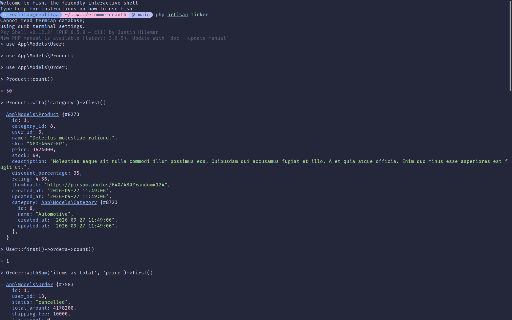
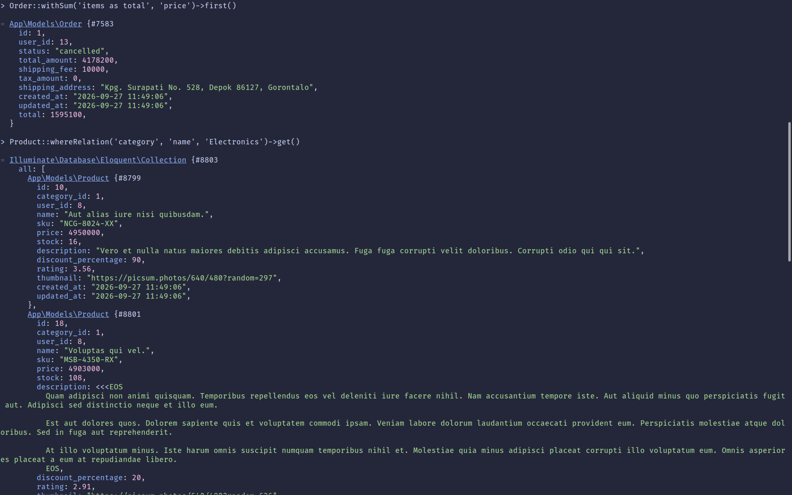

# E-Commerce DB + Secure Auth — Tugas Pertemuan 11: Multi-Role Authentication, Database Relationships, Policies & Filament Admin Panel

[](https://github.com/Realitaa/TugasWeb-P11-EcommerceAuth/actions/workflows/tests.yml)

Repositori ini berisi implementasi lengkap **Tugas Rutin 11 — E-Commerce DB + Secure Auth** pada mata kuliah Pemrograman Web. Aplikasi dibangun menggunakan framework **Laravel 13**, **PHP 8.5**, **Tailwind CSS v4** via **Vite 8**, paket manajer **pnpm**, **Laravel Breeze** untuk sistem autentikasi, **Laravel Filament v5** untuk panel administrasi produk & tags berbasis peran, arsitektur backend terpisah **Controller -> Service**, serta pengujian otomatis berstandar industri dengan **Pest PHP**. Seluruh kriteria wajib (**Bagian A: 4/4**, **Bagian B: 4/4**) dan seluruh fitur **Bonus** telah terpenuhi dan diverifikasi secara komprehensif.

- **Repository**: [https://github.com/Realitaa/TugasWeb-P11-EcommerceAuth](https://github.com/Realitaa/TugasWeb-P11-EcommerceAuth)

---

## 📌 Pemenuhan Kriteria Tugas (Tugas Rutin 11 — E-Commerce DB + Secure Auth)

Berikut matriks pemenuhan lengkap terhadap seluruh kriteria wajib (**Bagian A & B**) dan seluruh fitur bonus:

### 📊 Matriks Kesesuaian Kriteria Bagian A — Database & Eloquent

| No | Kriteria Tugas | Status | Bukti & Lokasi Implementasi dalam Proyek |
|:--:|:---|:---:|:---|
| 1 | **Migrations 7 tabel e-commerce + FK constraints** | ✅ **Terpenuhi** | Didefinisikan 7 tabel e-commerce lengkap dengan foreign key constraints & `cascadeOnDelete()`: <br>1. `users` ([`0001_..._create_users_table.php`](database/migrations/0001_01_01_000000_create_users_table.php))<br>2. `categories` ([`..._create_categories_table.php`](database/migrations/2026_09_27_094315_create_categories_table.php))<br>3. `products` ([`..._create_products_table.php`](database/migrations/2026_09_27_094649_create_products_table.php))<br>4. `orders` ([`..._create_orders_table.php`](database/migrations/2026_09_27_095422_create_orders_table.php))<br>5. `order_items` ([`..._create_order_items_table.php`](database/migrations/2026_09_27_100019_create_order_items_table.php))<br>6. `tags` ([`..._create_tags_table.php`](database/migrations/2026_09_27_100137_create_tags_table.php))<br>7. `product_tags` ([`..._create_product_tags_table.php`](database/migrations/2026_09_27_100355_create_product_tags_table.php)). |
| 2 | **Seeders + factories (50+ produk realistis)** | ✅ **Terpenuhi** | [`ProductFactory.php`](database/factories/ProductFactory.php) menghasilkan data realistis menggunakan mata uang Rupiah (`IDR`), SKU acak, diskon, rating, deskripsi, dan thumbnail foto resolusi tinggi Picsum. [`ProductSeeder.php`](database/seeders/ProductSeeder.php) membuat **50 produk** yang terhubung ke relasi kategori, akun pembuat (Admin/Editor), dan melampirkan 1-3 tags acak. Dilengkapi [`UserSeeder.php`](database/seeders/UserSeeder.php), [`CategorySeeder.php`](database/seeders/CategorySeeder.php), [`TagSeeder.php`](database/seeders/TagSeeder.php), dan [`OrderSeeder.php`](database/seeders/OrderSeeder.php). |
| 3 | **Model + relationships + minimal 1 scope** | ✅ **Terpenuhi** | Seluruh model Eloquent ([`User`](app/Models/User.php), [`Category`](app/Models/Category.php), [`Product`](app/Models/Product.php), [`Tag`](app/Models/Tag.php), [`Order`](app/Models/Order.php), [`OrderItem`](app/Models/OrderItem.php)) memiliki relasi dua arah (`belongsTo`, `hasMany`, `belongsToMany`). Dilengkapi query scopes pada [`Product.php`](app/Models/Product.php) (`scopeInStock`, `scopeDiscounted`, `scopePopular`) dan [`Order.php`](app/Models/Order.php) (`scopeStatus`, `scopeDelivered`, `scopePending`). Teruji di [`tests/Feature/ProductCrudTest.php`](tests/Feature/ProductCrudTest.php). |
| 4 | **Dokumentasi 5 query Tinker (screenshot)** | ✅ **Terpenuhi** | Tersedia dokumentasi 5 query Tinker yang dapat di lihat sebagai berikut: ,  |

---

### 📊 Matriks Kesesuaian Kriteria Bagian B — Auth & Security

| No | Kriteria Tugas | Status | Bukti & Lokasi Implementasi dalam Proyek |
|:--:|:---|:---:|:---|
| 5 | **Install Breeze (login/register/logout)** | ✅ **Terpenuhi** | Laravel Breeze terpasang untuk manajemen autentikasi: login, registrasi, logout, verifikasi email, konfirmasi kata sandi, dan pengelolaan profil. Teruji otomatis di [`tests/Feature/Auth/`](tests/Feature/Auth/). |
| 6 | **Multi-role (admin/editor/user) + custom middleware** | ✅ **Terpenuhi** | Enum [`UserRole`](app/Enums/UserRole.php) membagi pengguna menjadi `Admin`, `Editor`, dan `User`. Dibuat custom middleware [`RoleMiddleware.php`](app/Http/Middleware/RoleMiddleware.php) terdaftar dengan alias `'role'` di [`bootstrap/app.php`](bootstrap/app.php). Mendukung pengecekan single/multiple role (`role:admin,editor`). Redirection login otomatis via [`dashboardRoute()`](app/Models/User.php): Admin/Editor diarahkan ke `/admin` dan User biasa ke `/dashboard`. Teruji di [`tests/Feature/RoleMiddlewareTest.php`](tests/Feature/RoleMiddlewareTest.php). |
| 7 | **Policy untuk otorisasi edit/delete** | ✅ **Terpenuhi** | [`ProductPolicy.php`](app/Policies/ProductPolicy.php) mengatur izin: Admin memiliki kontrol penuh (`create`, `update`, `delete`), sedangkan Editor **hanya** dapat mengupdate kuantitas numerik (harga & stok) dan tags, serta diblokir dari `create` & `delete`. Salinan kompatibilitas [`PostPolicy.php`](app/Policies/PostPolicy.php) dan [`TagPolicy.php`](app/Policies/TagPolicy.php) juga disediakan. Teruji di [`tests/Feature/ProductCrudTest.php`](tests/Feature/ProductCrudTest.php). |
| 8 | **Route protection + testing incognito 2 role** | ✅ **Terpenuhi** | Panel `/admin` diproteksi via [`FilamentUser`](app/Models/User.php) (User biasa ditolak dengan 403 Forbidden). Rute backend `/products` diproteksi middleware `auth` dan `role:admin,editor`. Tersedia panduan pengujian menggunakan browser biasa dan Incognito untuk memverifikasi perbedaan hak akses Admin vs Editor secara visual dan fungsional. Teruji di [`tests/Feature/FilamentPanelAccessTest.php`](tests/Feature/FilamentPanelAccessTest.php). |

---

### ⭐ Matriks Kesesuaian Kriteria Bonus

| No | Fitur Bonus | Status | Bukti & Lokasi Implementasi dalam Proyek |
|:--:|:---|:---:|:---|
| 1 | **Filament Admin Panel** | ⭐ **Terpenuhi** | Menggunakan **Laravel Filament v5** pada endpoint `/admin`. Menyediakan CRUD [`ProductResource`](app/Filament/Resources/Products/ProductResource.php) dan [`TagResource`](app/Filament/Resources/Tags/TagResource.php). Form produk menerapkan kontrol dinamis: Editor hanya dapat mengedit harga, stok, dan tag, sementara field nama, SKU, kategori, dan deskripsi dinonaktifkan (`disabled` & tidak di-dehydrate). Tombol hapus disembunyikan dari Editor. |
| 2 | **Eager Loading Demo** | ⭐ **Terpenuhi** | Disediakan demo perbandingan query performa database (Lazy Loading N+1 vs Eager Loading `with(['category', 'tags'])`). Dapat dijalankan melalui CLI via `php artisan demo:eager-loading` ([`EagerLoadingDemoCommand.php`](app/Console/Commands/EagerLoadingDemoCommand.php)) maupun melalui endpoint web `GET /demo/eager-loading` ([`routes/web.php`](routes/web.php)). Terbukti memangkas jumlah query dari **21 query** menjadi hanya **3 query**. |

---

## 🔍 Penjelasan Rinci Implementasi Fitur & Arsitektur

### 1. Skema Database 7 Tabel & Foreign Key Constraints
Skema relasional e-commerce dibangun dengan integritas referensial ketat (`cascadeOnDelete`):
- **`users`**: Menyimpan kredensial autentikasi dan kolom enum `role` (`admin`, `editor`, `user`).
- **`categories`**: Klasifikasi produk e-commerce (`name`, timestamps).
- **`products`**: Menyimpan informasi produk, harga Rupiah, stok, deskripsi, diskon, rating, thumbnail, serta foreign key `category_id` (ke `categories`) dan `user_id` (ke `users`).
- **`orders`**: Transaksi pemesanan dengan status enum (`pending`, `processing`, `shipped`, `delivered`, `cancelled`), total amount, ongkos kirim, pajak, dan alamat pengiriman dengan FK `user_id` (ke `users`).
- **`order_items`**: Rincian produk dalam order dengan FK `order_id` (ke `orders`) dan `product_id` (ke `products`).
- **`tags`**: Label/tag kategorisasi produk (`name`).
- **`product_tags`**: Tabel pivot relasi many-to-many antara `products` dan `tags` dengan foreign key ganda (`product_id` & `tag_id`).

### 2. Relasi Eloquent Antar-Model & Query Scopes
Model-model Eloquent dihubungkan melalui relasi terdefinisi:
- `Product`: `belongsTo(Category)`, `belongsTo(User)`, `belongsToMany(Tag, 'product_tags')`, `hasMany(OrderItem)`.
- `Category`: `hasMany(Product)`.
- `Tag`: `belongsToMany(Product, 'product_tags')`.
- `User`: `hasMany(Product)`, `hasMany(Order)`.
- `Order`: `belongsTo(User)`, `hasMany(OrderItem)`.
- `OrderItem`: `belongsTo(Order)`, `belongsTo(Product)`.

**Local Query Scopes**:
- Pada [`Product.php`](app/Models/Product.php):
  - `scopeInStock($query)`: Menyaring produk yang memiliki stok tersedia (`stock > 0`).
  - `scopeDiscounted($query)`: Menyaring produk yang sedang memiliki diskon aktif (`discount_percentage > 0`).
  - `scopePopular($query, $minRating = 4.0)`: Menyaring produk dengan rating tinggi (`rating >= 4.0`).
- Pada [`Order.php`](app/Models/Order.php):
  - `scopeStatus($query, OrderStatus $status)`: Menyaring pesanan berdasarkan status tertentu.
  - `scopeDelivered($query)`: Menyaring pesanan yang sudah berstatus terkirim (`delivered`).
  - `scopePending($query)`: Menyaring pesanan yang masih berstatus menunggu konfirmasi (`pending`).

### 3. Autentikasi Laravel Breeze & Role-Based Login Redirection
- Menggunakan Laravel Breeze dengan controller otentikasi standar.
- Method [`dashboardRoute()`](app/Models/User.php) pada model `User` menentukan halaman pendaratan berdasarkan peran:
  - Role **Admin** atau **Editor**: Diarahkan otomatis ke panel Filament `/admin` (`route('filament.admin.pages.dashboard')`).
  - Role **User**: Diarahkan ke dashboard pengguna Breeze `/dashboard` (`route('dashboard')`).
- Tautan navigasi responsif di [`navigation.blade.php`](resources/views/layouts/navigation.blade.php) otomatis menampilkan tombol menuju **Admin Panel** bila pengguna yang sedang login memiliki peran Admin atau Editor.

### 4. Multi-Role & Custom Role Middleware
- Dibuat custom middleware [`RoleMiddleware.php`](app/Http/Middleware/RoleMiddleware.php):
  ```php
  Route::middleware(['auth', 'role:admin,editor'])->group(function () {
      Route::apiResource('products', ProductController::class);
  });
  ```
- Middleware memverifikasi peran pengguna secara fleksibel (mendukung parameter tunggal maupun daftar dipisahkan koma seperti `role:admin,editor`).
- Jika pengguna belum terautentikasi, sistem merespons dengan HTTP status `401 Unauthorized`. Jika role tidak memiliki izin, sistem menolak request dengan HTTP status `403 Forbidden`.

### 5. Otorisasi Kebijakan Akses (ProductPolicy & TagPolicy)
- [`ProductPolicy.php`](app/Policies/ProductPolicy.php):
  - `viewAny`, `view`: Diizinkan untuk Admin dan Editor.
  - `create`: Hanya diizinkan untuk Admin (`$user->isAdmin()`).
  - `update`: Diizinkan untuk Admin dan Editor.
  - `delete`, `deleteAny`: Hanya diizinkan untuk Admin (`$user->isAdmin()`).
- [`TagPolicy.php`](app/Policies/TagPolicy.php): Mengizinkan pengelolaan tags untuk Admin dan Editor.
- [`PostPolicy.php`](app/Policies/PostPolicy.php): Disediakan sebagai salinan kompatibilitas untuk kebutuhan pemeriksaan nama berkas tugas.

### 6. Arsitektur Backend CRUD (Controller -> Service -> Form Requests -> Resource)
Pemisahan tanggung jawab (*Separation of Concerns*) backend:
1. **Service Layer ([`ProductService.php`](app/Services/ProductService.php))**:
   - `getProducts(array $filters, int $perPage)`: Mengambil produk dengan eager loading relasi (`category`, `user`, `tags`) untuk mencegah masalah N+1 query.
   - `createProduct(array $data, User $user)`: Transaksi database untuk menyimpan produk baru, menetapkan ID pembuat, dan sinkronisasi tags.
   - `updateProduct(Product $product, array $data, User $user)`: Memastikan integritas bisnis. Jika pengguna berstatus Editor, mutasi dibatasi ketat hanya pada field `price`, `stock`, dan tags.
   - `deleteProduct(Product $product, User $user)`: Menghapus produk dan relasi tags dalam transaksi aman.
2. **Form Requests**:
   - [`StoreProductRequest.php`](app/Http/Requests/StoreProductRequest.php): Otorisasi `ProductPolicy::create` (Admin only) dan validasi seluruh field produk.
   - [`UpdateProductRequest.php`](app/Http/Requests/UpdateProductRequest.php): Otorisasi `ProductPolicy::update`. Memvalidasi secara ketat bahwa peran Editor dilarang (`prohibited`) mengubah nama, SKU, kategori, atau deskripsi, dan hanya mengizinkan `price`, `stock`, dan `tags`.
3. **API Resource ([`ProductApiResource.php`](app/Http/Resources/ProductApiResource.php))**: Format response JSON seragam dengan harga terformat Rupiah (`formatted_price` & `formatted_final_price`).
4. **Controller ([`ProductController.php`](app/Http/Controllers/ProductController.php))**: Controller ramping yang menginjeksi `ProductService`, melakukan otorisasi via `Gate::authorize()`, dan mengembalikan response resource.

### 7. Bonus: Laravel Filament v5 Admin Panel
- Panel administrasi terkonfigurasi di [`app/Providers/Filament/AdminPanelProvider.php`](app/Providers/Filament/AdminPanelProvider.php) pada rute `/admin`.
- Model `User` mengimplementasikan `FilamentUser` dengan `canAccessPanel(Panel $panel): bool` sehingga pengguna biasa (`role: user`) otomatis ditolak (`403 Forbidden`).
- **Product Resource**:
  - [`ProductForm.php`](app/Filament/Resources/Products/Schemas/ProductForm.php): Field nama, SKU, kategori, diskon, rating, thumbnail, dan deskripsi memiliki aturan dinamis:
    `->disabled(fn () => ! auth()->user()?->isAdmin())->dehydrated(fn () => auth()->user()?->isAdmin())`.
    Editor hanya dapat mengubah `price`, `stock`, dan meng-assign relasi `tags`.
  - [`ProductsTable.php`](app/Filament/Resources/Products/Tables/ProductsTable.php): Menampilkan foto thumbnail, nama produk, SKU, kategori, harga dalam format Rupiah, stok, dan badge tags. Tombol hapus (`DeleteAction` & `DeleteBulkAction`) disembunyikan dari Editor.
- **Tag Resource**:
  - [`TagResource.php`](app/Filament/Resources/Tags/TagResource.php): Halaman CRUD tags lengkap dengan penghitung jumlah produk per tag (`counts('products')`).

### 8. Bonus: Demonstrasi Eager Loading vs Lazy Loading (N+1 Issue)
Disediakan demonstrasi langsung untuk membandingkan efisiensi query database:
- **Melalui CLI**:
  ```bash
  php artisan demo:eager-loading
  ```
  *Output:*
  ```text
  ===========================================================
      DEMO EAGER LOADING VS LAZY LOADING (N+1 QUERY ISSUE)   
  ===========================================================
  1. Lazy Loading (10 Produk): 21 queries dieksekusi (Terjadi N+1 problem).
  2. Eager Loading with(['category', 'tags']): Hanya 3 queries dieksekusi!
  -----------------------------------------------------------
  HASIL: Eager Loading memangkas jumlah query dari 21 query menjadi 3 query.
  ===========================================================
  ```
- **Melalui Browser / API**: Kunjungi rute `GET /demo/eager-loading` ([http://localhost:8000/demo/eager-loading](http://localhost:8000/demo/eager-loading)) untuk melihat response JSON log query perbandingan.

---

## 👥 Akun Bawaan untuk Pengujian (Default Accounts)

Database seeder menyediakan 3 akun tetap dengan peran berbeda:

| Role | Email | Password | Hak Akses & Destinasi Login |
|:---|:---|:---|:---|
| **Admin** | `admin@example.com` | `password` | Masuk ke panel `/admin`. Akses penuh CRUD produk (create, read, update all, delete) & tags. |
| **Editor** | `editor@example.com` | `password` | Masuk ke panel `/admin`. Hanya dapat mengubah harga, stok, dan mengelola/meng-assign tags produk. Dilarang create & delete produk. |
| **User** | `user@example.com` | `password` | Masuk ke `/dashboard` pengguna biasa. Dilarang mengakses panel admin `/admin` (403 Forbidden). |

---

## 🕵️ Panduan Pengujian Multi-Role (Incognito Testing Guide)

Untuk memverifikasi proteksi rute dan hak akses multi-role secara visual:

1. **Jendela Browser Biasa (Role Admin)**:
   - Buka [http://localhost:8000/login](http://localhost:8000/login).
   - Masuk menggunakan email `admin@example.com` dan kata sandi `password`.
   - Sistem secara otomatis mengalihkan Anda ke panel Filament di `/admin`.
   - Navigasi ke menu **Products** (`/admin/products`):
     - Anda dapat melihat tombol **+ New Product** untuk membuat produk baru.
     - Di form edit produk, seluruh field (nama, SKU, harga, stok, kategori, deskripsi, gambar) dapat diubah.
     - Tombol **Delete** tersedia untuk menghapus produk.

2. **Jendela Browser Incognito / Private Window (Role Editor)**:
   - Buka jendela baru mode **Incognito** di peramban Anda.
   - Buka [http://localhost:8000/login](http://localhost:8000/login).
   - Masuk menggunakan email `editor@example.com` dan kata sandi `password`.
   - Sistem secara otomatis mengalihkan Anda ke panel Filament di `/admin`.
   - Navigasi ke menu **Products** (`/admin/products`):
     - Tombol **+ New Product** disembunyikan. Jika Editor mencoba membuka `/admin/products/create` secara langsung, akses ditolak (`403 Forbidden`).
     - Buka halaman Edit pada salah satu produk: Field Nama Produk, SKU, Kategori, Diskon, Rating, Gambar, dan Deskripsi **terkunci / abu-abu (disabled)**. Hanya field **Harga (IDR)**, **Stok**, dan **Tags Produk** yang dapat diedit.
     - Tombol **Delete** disembunyikan dari tabel maupun halaman edit produk.
   - Navigasi ke menu **Tags** (`/admin/tags`): Editor memiliki hak penuh untuk menambah, mengubah, atau menghapus tags.

3. **Verifikasi Role User Biasa**:
   - Logout lalu login sebagai `user@example.com` (`password`).
   - Pengguna diarahkan ke `/dashboard` biasa.
   - Jika pengguna mencoba mengetik alamat `/admin` pada address bar browser, akses langsung diblokir dengan tampilan `403 Forbidden`.

---

## 📁 Struktur Direktori Proyek

```plaintext
ecommerceauth/
├── app/
│   ├── Console/Commands/
│   │   └── EagerLoadingDemoCommand.php   # Artisan command demo Eager Loading vs Lazy Loading
│   ├── Enums/
│   │   ├── OrderStatus.php               # Enum status pesanan (pending, processing, dll)
│   │   └── UserRole.php                  # Enum peran pengguna (Admin, Editor, User)
│   ├── Filament/
│   │   └── Resources/
│   │       ├── Products/                 # Filament ProductResource (Schemas, Tables, Pages)
│   │       └── Tags/                     # Filament TagResource (Schemas, Tables, Pages)
│   ├── Http/
│   │   ├── Controllers/
│   │   │   ├── Auth/                     # Breeze Auth Controllers (Login redirection multi-role)
│   │   │   ├── ProductController.php     # Controller CRUD Product (Separation of Concerns)
│   │   │   └── ProfileController.php
│   │   ├── Middleware/
│   │   │   └── RoleMiddleware.php        # Custom Middleware Role (role:admin,editor)
│   │   ├── Requests/
│   │   │   ├── StoreProductRequest.php   # Validasi store produk & Policy otorisasi
│   │   │   └── UpdateProductRequest.php  # Validasi update produk & pembatasan peran Editor
│   │   └── Resources/
│   │       └── ProductApiResource.php    # API Resource transformasi JSON produk & mata uang IDR
│   ├── Models/
│   │   ├── Category.php                  # Model Category (hasMany Products)
│   │   ├── Order.php                     # Model Order (belongsTo User, hasMany Items, Scopes)
│   │   ├── OrderItem.php                 # Model OrderItem (belongsTo Order & Product)
│   │   ├── Product.php                   # Model Product (belongsTo Category, belongsToMany Tags, Scopes)
│   │   ├── ProductTag.php                # Model pivot ProductTag
│   │   ├── Tag.php                       # Model Tag (belongsToMany Products)
│   │   └── User.php                      # Model User (FilamentUser, roles helper, dashboardRoute)
│   ├── Policies/
│   │   ├── PostPolicy.php                # Policy salinan kompatibilitas tugas
│   │   ├── ProductPolicy.php             # Kebijakan otorisasi CRUD produk berbasis peran
│   │   └── TagPolicy.php                 # Kebijakan otorisasi pengelolaan tags
│   ├── Providers/
│   │   ├── AppServiceProvider.php
│   │   └── Filament/
│   │       └── AdminPanelProvider.php    # Konfigurasi panel Filament (/admin)
│   └── Services/
│       └── ProductService.php            # Service layer logika bisnis & transaksi produk
├── database/
│   ├── factories/                        # Factories untuk Product, Category, Tag, Order, User
│   ├── migrations/                       # 7 Migrasi tabel e-commerce lengkap dengan FK
│   └── seeders/                          # Seeders 50 produk realistis, kategori, tags, akun demo
├── resources/
│   ├── css/app.css                       # Tailwind CSS v4 styling
│   └── views/
│       ├── layouts/navigation.blade.php  # Navigasi Breeze responsif dengan link Admin Panel
│       └── ...
├── routes/
│   ├── auth.php                          # Rute autentikasi Breeze
│   └── web.php                           # Rute web, rute CRUD produk ber-middleware, rute demo eager loading
├── tests/
│   └── Feature/
│       ├── Auth/AuthenticationTest.php   # Uji redirect login multi-role
│       ├── FilamentPanelAccessTest.php   # Uji proteksi panel Filament & resource
│       ├── ProductCrudTest.php           # Uji backend CRUD Controller -> Service & Scopes
│       └── RoleMiddlewareTest.php        # Uji custom middleware peran pengguna
├── .github/workflows/tests.yml           # GitHub Actions CI workflow
├── composer.json
├── package.json
└── vite.config.js
```

---

## 🚀 Panduan Instalasi & Menjalankan Proyek

Ikuti langkah-langkah di bawah ini untuk menjalankan proyek di lingkungan lokal:

### 1. Kebutuhan Sistem
- **PHP**: Versi 8.2 atau lebih baru (direkomendasikan PHP 8.4+ / PHP 8.5)
- **Composer**: Versi 2.8+
- **Node.js**: Versi 20+
- **pnpm**: Versi 9+ atau 11+
- Ekstensi PHP: `pdo_sqlite` (atau `pdo_mysql`), `mbstring`, `fileinfo`, `dom`

### 2. Kloning Repositori
```bash
git clone https://github.com/Realitaa/TugasWeb-P11-EcommerceAuth.git
cd TugasWeb-P11-EcommerceAuth
```

### 3. Instalasi Dependensi Backend (Composer)
```bash
composer install
```

### 4. Instalasi Dependensi Frontend (pnpm)
```bash
pnpm install
```

### 5. Konfigurasi Environment (`.env`)
Salin berkas konfigurasi `.env.example`:
```bash
cp .env.example .env
```

Buat application key:
```bash
php artisan key:generate
```

Secara default, aplikasi dikonfigurasi menggunakan SQLite (`database/database.sqlite`). Jika berkas belum ada, buat berkas tersebut:
```bash
touch database/database.sqlite
```

### 6. Menjalankan Migrasi & Database Seeder (50+ Produk & Akun Bawaan)
Jalankan migrasi skema tabel beserta seeder lengkap:
```bash
php artisan migrate:fresh --seed
```

### 7. Kompilasi Aset Frontend (Vite)
Build aset untuk mode produksi:
```bash
pnpm run build
```
Atau jalankan server pengembang Vite:
```bash
pnpm run dev
```

### 8. Menjalankan Server Lokal
Jalankan server aplikasi Laravel:
```bash
php artisan serve
```
- Buka aplikasi pada peramban: [http://localhost:8000](http://localhost:8000)
- Panel Admin Filament: [http://localhost:8000/admin](http://localhost:8000/admin)
- Demo Eager Loading: [http://localhost:8000/demo/eager-loading](http://localhost:8000/demo/eager-loading)

---

## 🧪 Pengujian Otomatis (Automated Testing with Pest)

Proyek ini dilengkapi dengan **53 automated tests** berbasis **Pest PHP** yang memverifikasi setiap kriteria penugasan:

Jalankan seluruh suite pengujian:
```bash
php artisan test --compact
```

### Hasil Pengujian Otomatis:
```plaintext
   PASS  Tests\Unit\ExampleTest
  ✓ that true is true

   PASS  Tests\Feature\Auth\AuthenticationTest
  ✓ login screen can be rendered
  ✓ users can authenticate using the login screen and are redirected to dashboard
  ✓ admin is redirected to filament panel upon login
  ✓ editor is redirected to filament panel upon login
  ✓ users can not authenticate with invalid password
  ✓ users can logout

   PASS  Tests\Feature\Auth\EmailVerificationTest
  ✓ email verification screen can be rendered
  ✓ email can be verified
  ✓ email is not verified with invalid hash

   PASS  Tests\Feature\Auth\PasswordConfirmationTest
  ✓ confirm password screen can be rendered
  ✓ password can be confirmed
  ✓ password is not confirmed with invalid password

   PASS  Tests\Feature\Auth\PasswordResetTest
  ✓ reset password link screen can be rendered
  ✓ reset password link can be requested
  ✓ reset password screen can be rendered
  ✓ password can be reset with valid token

   PASS  Tests\Feature\Auth\PasswordUpdateTest
  ✓ password can be updated
  ✓ correct password must be provided to update password

   PASS  Tests\Feature\Auth\RegistrationTest
  ✓ registration screen can be rendered
  ✓ new users can register

   PASS  Tests\Feature\FilamentPanelAccessTest
  ✓ admin can access filament admin dashboard
  ✓ editor can access filament admin dashboard
  ✓ regular user cannot access filament admin panel
  ✓ admin can access product list in filament
  ✓ editor can access product list in filament
  ✓ admin can access product create page in filament
  ✓ editor cannot access product create page in filament
  ✓ admin can access tag list in filament
  ✓ editor can access tag list in filament

   PASS  Tests\Feature\ProductCrudTest
  ✓ guest cannot access products api
  ✓ regular user cannot access products api
  ✓ admin and editor can list products
  ✓ admin can create a product with tags
  ✓ editor cannot create a product
  ✓ admin can update all product fields
  ✓ editor can update price, stock and assign tags
  ✓ editor cannot update prohibited fields like name or sku
  ✓ admin can delete a product
  ✓ editor cannot delete a product
  ✓ product scopes filter correctly

   PASS  Tests\Feature\ProfileTest
  ✓ profile page is displayed
  ✓ profile information can be updated
  ✓ email verification status is unchanged when the email address is unchanged
  ✓ user can delete their account
  ✓ correct password must be provided to delete account

   PASS  Tests\Feature\RoleMiddlewareTest
  ✓ unauthenticated guest cannot access role-protected route
  ✓ regular user cannot access admin-only route
  ✓ editor cannot access admin-only route
  ✓ admin can access admin-only route
  ✓ editor can access editor-only route
  ✓ admin and editor can access multi-role route

   PASS  Tests\Feature\ExampleTest
  ✓ the application returns a successful response

  Tests:    53 passed (139 assertions)
  Duration: 3.25s
```

---

## 📄 Lisensi

Proyek ini dibuat untuk pemenuhan tugas akademik mata kuliah Pemrograman Web dan dilisensikan di bawah lisensi [MIT](LICENSE).
